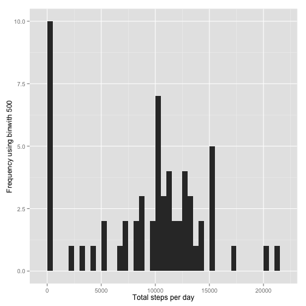
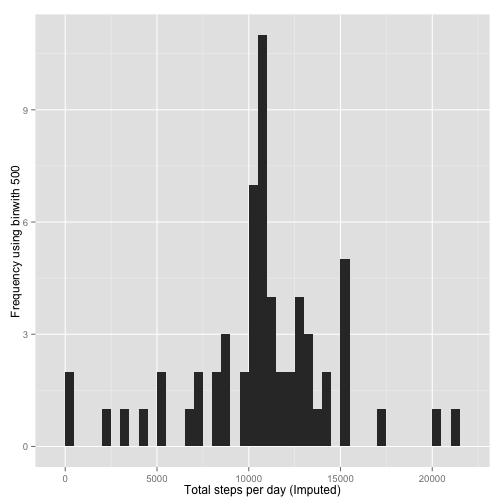

# Reproducible Research: Peer Assessment 1


## Loading and preprocessing the data
##### 1. Load the data (i.e. read.csv())

```r
activityData <- read.csv('activity.csv')
```
##### 2. Process/transform the data (if necessary) into a format suitable for your analysis

```r
#activityData$interval <- strptime(gsub("([0-9]{1,2})([0-9]{2})", "\\1:\\2", activityData$interval), format='%H:%M')
```

-----
  
  ## What is mean total number of steps taken per day?
  
  ```r
steps_by_day <- tapply(activityData$steps, activityData$date, sum, na.rm=TRUE)
```

##### 1. Make a histogram of the total number of steps taken each day

```r
qplot(steps_by_day, xlab='Total steps per day', ylab='Frequency using binwith 500', binwidth=500)
```

 

##### 2. Calculate and report the mean and median total number of steps taken per day

```r
steps_by_dayMean <- mean(steps_by_day)
steps_by_dayMedian <- median(steps_by_day)
```
* Mean: 9354.2295
* Median:  10395

-----
  
  ## What is the average daily activity pattern?
  
  ```r
averageStepsPerTimeBlock <- aggregate(x=list(meanSteps=activityData$steps), by=list(interval=activityData$interval), FUN=mean, na.rm=TRUE)
```

##### 1. Make a time series plot

```r
ggplot(data=averageStepsPerTimeBlock, aes(x=interval, y=meanSteps)) +
  geom_line() +
  xlab("5-minute interval") +
  ylab("average number of steps taken") 
```

 

##### 2. Which 5-minute interval, on average across all the days in the dataset, contains the maximum number of steps?

```r
mostSteps <- which.max(averageStepsPerTimeBlock$meanSteps)
timeMostSteps <-  gsub("([0-9]{1,2})([0-9]{2})", "\\1:\\2", averageStepsPerTimeBlock[mostSteps,'interval'])
```

* Most Steps at: 8:35

----
  
  ## Imputing missing values
  ##### 1. Calculate and report the total number of missing values in the dataset 
  
  ```r
numMissingValues <- length(which(is.na(activityData$steps)))
```

* Number of missing values: 2304

##### 2. Devise a strategy for filling in all of the missing values in the dataset.
##### 3. Create a new dataset that is equal to the original dataset but with the missing data filled in.

```r
activityDataImputed <- activityData
activityDataImputed$steps <- impute(activityData$steps, fun=mean)
```


##### 4. Make a histogram of the total number of steps taken each day 

```r
steps_by_dayImputed <- tapply(activityDataImputed$steps, activityDataImputed$date, sum)
qplot(steps_by_dayImputed, xlab='Total steps per day (Imputed)', ylab='Frequency using binwith 500', binwidth=500)
```

 

##### ... and Calculate and report the mean and median total number of steps taken per day. 

```r
steps_by_dayMeanImputed <- mean(steps_by_dayImputed)
steps_by_dayMedianImputed <- median(steps_by_dayImputed)
```
* Mean (Imputed): 1.0766 &times; 10<sup>4</sup>
  * Median (Imputed):  1.0766 &times; 10<sup>4</sup>
  
  
  ----
  
  ## Are there differences in activity patterns between weekdays and weekends?
  ##### 1. Create a new factor variable in the dataset with two levels – “weekday” and “weekend” indicating whether a given date is a weekday or weekend day.
  
  
  ```r
activityDataImputed$dateType <-  ifelse(as.POSIXlt(activityDataImputed$date)$wday %in% c(0,6), 'weekend', 'weekday')
```

##### 2. Make a panel plot containing a time series plot


```r
averagedActivityDataImputed <- aggregate(steps ~ interval + dateType, data=activityDataImputed, mean)
ggplot(averagedActivityDataImputed, aes(interval, steps)) + 
  geom_line() + 
  facet_grid(dateType ~ .) +
  xlab("5-minute interval") + 
  ylab("avarage number of steps")
```

 
